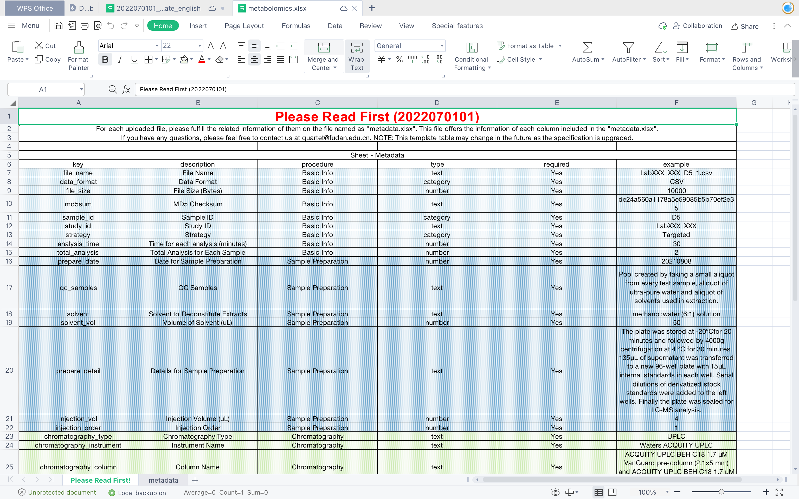

## Metadata Validator

<!-- 

 -->

### Installation

```bash
pip install metadata_validator
```

or 

```bash
git clone https://github.com/chinese-quartet/metadata-validator.git
cd metadata-validator
python setup.py install
```

### Usage

```bash
Usage: metav [OPTIONS] COMMAND [ARGS]...

Options:
  --help  Show this message and exit.

Commands:
  generate-template  Generate metadata template as a xlsx file.
  validate           Metadata Validator
```

```bash
Usage: metav validate [OPTIONS]

  Metadata Validator

Options:
  -i, --input FILE                Input file path, only support xlsx file.
                                  [required]
  -o, --output TEXT               Output error and warning messages as a file.
                                  [required]
  -t, --template-type [DNAseq|RNAseq|Proteomics|Metabolomics]
                                  It support the following metadata tables:
                                  'DNAseq', 'RNAseq', 'Proteomics,
                                  'Metabolomics'  [required]
  --help                          Show this message and exit.
```

```bash
Usage: metav generate-template [OPTIONS]

  Generate metadata template as a xlsx file.

Options:
  -o, --output TEXT               Output metadata template as a file.
                                  [required]
  -t, --template-type [DNAseq|RNAseq|Proteomics|Metabolomics]
                                  It support the following metadata tables:
                                  'DNAseq', 'RNAseq', 'Proteomics,
                                  'Metabolomics'  [required]
  --help                          Show this message and exit.
```

### Example

#### Generate metadata template

```bash
metav generate-template -t Metabolomics -o metabolomics_metadata.xlsx
```



#### Validate metadata

Validate your metadata file of Metabolomics template with the following command:

```bash
metav validate -i your_metadata_file.xlsx -o output.log -t Metabolomics
```

### Metada

* Free software: MIT license
* Documentation: https://metadata-validator.readthedocs.io.

### Features

- Generate metadata template as a xlsx file.

- Validate metadata file.

### TODO

### Credits
This package was created with [Cookiecutter](https://github.com/audreyr/cookiecutter) and the [`audreyr/cookiecutter-pypackage`](https://github.com/audreyr/cookiecutter-pypackage) project template.